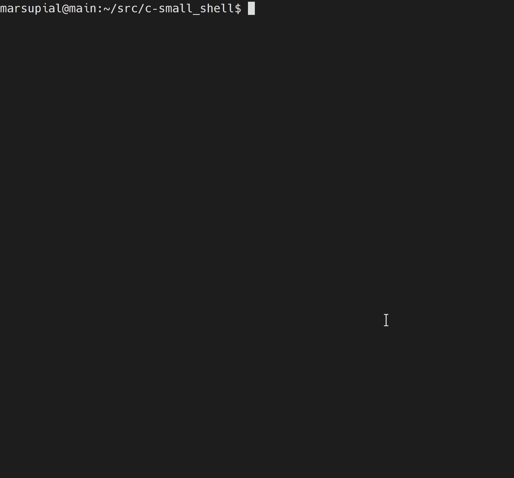

# smallsh - c shell

Custom bash-like shell written in C as the portfolio project for OSU's Operating Systems I class.  Demonstrates proficiency in the use of the Unix process API, signal handling, and I/O redirection.  
Grade received: 100

## Features / Description
- Provides prompt for running commands using bash-like [syntax](#general-syntax)
- Supports execution of shell scripts
- Handles blank lines and comments (defined as lines beginning with the # character)
- Provides variable expansion for any instance of `$$` in a given command, replacing with the shell Process ID
- Provides 3 built-in commands: 
    -`exit`: kills any processes / jobs started by shell before terminating shell itself
    -`cd`: provides bash-like functionality using the `chdir()` system call; supports both relative and absolute directory paths
    -`status`: prints either the exit status or the terminating signal of the last foreground process run the shell, excluding the 3 built-in commands
- Executes all other commands by creating new processes using the `fork()`, `exec()`, and `waitpid()` system calls
- Supports input and output redirection using the `dup2()` system call
- Supports execution of commands in both the foreground and background
- Implements custom signal handlers for the SIGINT and SIGTSTP signals

## Functionality Demo


## Installation
(requires gcc compiler)
- download or clone project source files, navigate to directory and run:
```bash
make
```

## Usage
##### starting shell:
```bash
./smallsh
```
##### quitting shell:
- input the `exit` command

##### general syntax:
```
command [arg1 arg2 ...] [< input_file] [> output_file] [&]
```
##### restrictions / bash differences:
- command is assumed to be comprised of words separated by spaces
- special symbols `<`, `>`, and `&` are recognized, but must be surrounded by spaces like other words
- if standard input or output is to be redirected, the `>` or `<` words followed by a filename word must appear after all the arguments. input redirection can appear before or after output redirection
- the pipe operator, `|`, is not implemented
- a command line has max length of 2048 characters, and 512 max arguments
- lines beginning with the `#` character (comments) or blank lines are both ignored (re-prompt for a new command)
- any instance of `$$` in a command is expanded into the process ID of the shell itself.  this is the only variable expansion supported by the shell
- any command, with the exception of `exit` `cd` and `status`, can be run in either foreground or background
    - if command is to be executed in background, last word must be `&`
##### signal handling:
- SIGINT (CTRL-C)
    - ignored by shell itself, or any children running as background processes
    - any child process running in foreground terminates itself upon receiving SIGINT
- SIGTSTP (CTRL-Z)
    - ignored by a child process running in foreground, or any children running as background processes
    - if received by parent processes running shell, shell enters state in which commands cannot be run in background (`&` operator is ignored; all commands are run in foreground)
    - if received again, shell toggles back to normal mode (background processes enabled)